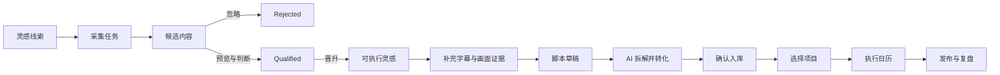
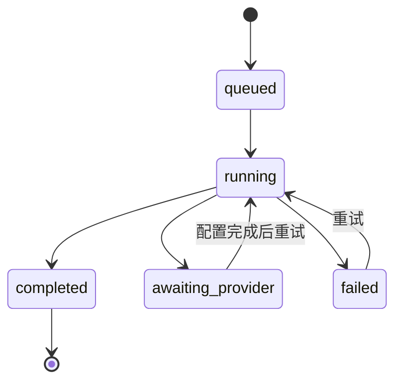
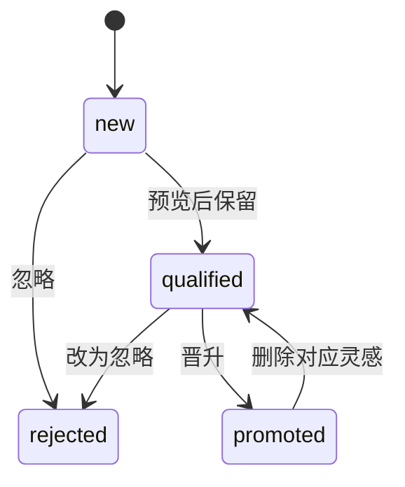
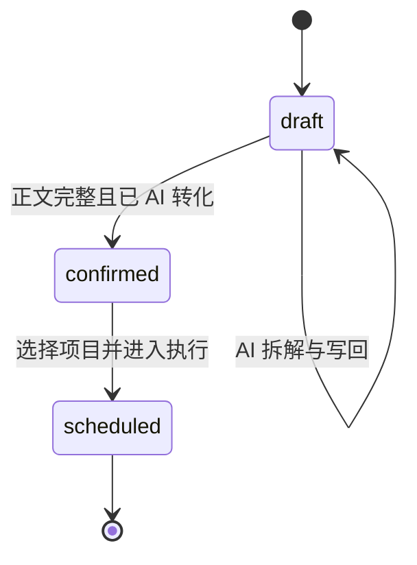

# 界面逻辑

本文件记录当前产品逻辑在这套视觉参考中的表达方式。它不新增业务能力，也不替换当前 store。

## 权限与上下文

1. 当前选中项目只提供默认焦点，不限制 Agent 或用户可见的项目集合。
2. 项目级写操作必须带项目名或明确项目 ID。
3. 多项目且用户没有点名时，必须先选择项目。
4. 采集检索只使用用户输入的独立词，不自动拼接项目名、品牌名或竞品名。
5. 新增、修改、删除真实记录时，Agent 先复述对象和字段，再等待确认。
6. 用户直接点击明确提交按钮可视为 UI 操作意图，破坏性操作仍需二次确认。

## 核心工作流

视觉上的关键是让每次跨对象转换都清楚可见。Candidate、Executable Inspiration、Script 和 Calendar Item 不是同一个对象的不同标签。

## 采集任务状态

| 状态 | 页面表达 | 可用动作 |
| --- | --- | --- |
| `queued` | 暖灰状态，显示等待原因 | 取消或查看条件 |
| `running` | 蓝色处理中，显示开始时间 | 查看进度，不重复提交 |
| `completed` | 绿色完成，显示结果数量 | 展开候选 |
| `awaiting-provider` | 琥珀提示，说明未配置 | 打开配置或保留任务 |
| `failed` | 红色错误，保留条件与消息 | 重试或修改线索 |

无结果必须区分：接口返回 0、接口有数据但时间窗内为 0、本地规则过滤后为 0。

## Candidate 状态

- `new`：刚进入候选池，未完成判断。
- `qualified`：值得继续转化，但还不是灵感资产。
- `rejected`：已忽略，默认不占据主结果。
- `promoted`：已经生成独立的 Executable Inspiration。
- 删除 Executable Inspiration 时，原 Candidate 恢复为 `qualified`，已生成脚本保留。

## 可执行灵感门槛

进入灵感库的对象必须保持：

- 标题与改编角度。
- 原始 URL。
- 来源账号与平台，能获取时必须保留。
- Hook。
- 镜头、话术、音乐建议。
- 类目、标签与批注。
- 创建和更新时间。

生成脚本草稿前必须同时存在：

1. 字幕 / 口播文本。
2. 画面证据笔记。

缺少任意一项时，界面显示具体缺项，不能将 AI 结果伪装成已理解视频。

## 脚本状态

### `draft`

- 可以编辑正文、类目、标签与来源。
- 从灵感生成的初始内容只是“原版证据草稿”。
- 至少完成一次 AI 拆解并写回后，才出现可确认状态。

### `confirmed`

- 已有正文。
- 已有 `aiAdaptedAt` 或等价的真实转化证据。
- 可以选择项目进入执行。

### `scheduled`

- 已创建关联 `CreatorContent`。
- 入口改为“查看执行日历”，不重复创建。

## 项目与执行

进入执行前必须选择一个真实项目。创建的内容对象保留：

- `projectId`
- 标题与脚本摘要
- 内容角色
- 内容类型
- 层级与优先级
- 当前制作阶段
- 计划日期
- 创建与更新时间

执行阶段沿用当前六段：`idea -> outline -> script -> shooting -> editing -> publish`。视觉阶段色只作辅助，阶段名称和状态文字始终可见。

## 删除与撤销

| 对象 | 删除前 | 删除后 |
| --- | --- | --- |
| 采集线索 | 显示线索名及受影响任务 | 非 promoted 候选随线索移除 |
| 可执行灵感 | 显示灵感名及脚本保留说明 | Candidate 恢复 qualified，脚本保留 |
| 脚本 | 显示脚本名及灵感保留说明 | 对话记录移除，灵感保留 |
| 日历任务 | 说明是取消排期还是删除内容 | 优先回到待安排池 |

短时可撤销操作使用 toast 提供“撤销”。不可逆或关联影响较大的操作使用确认对话框。

## 搜索、筛选与分层

- 搜索即时过滤，不修改原数据。
- 线索名与检索词是不同字段。线索名不得进入真实检索请求。
- 灵感库和脚本库支持时间、类目、标签三种分层。
- 空分组不展示。
- 清空搜索后恢复之前的选中条目；条目不存在时选择第一个可用项。
- 筛选条件在返回列表时应保留，避免反复重建上下文。

## AI 交互

1. AI 上下文绑定当前对象。
2. 发起请求前显示将使用的证据范围。
3. 请求中禁止重复提交。
4. 失败保留用户 prompt 与编辑内容。
5. AI 回复不自动覆盖脚本，用户点击“写入转化稿”后才写回。
6. 写回后记录真实完成时间。
7. provider 未配置时明确说明，不显示虚构结果。

## 响应式交互顺序

移动端按以下顺序折叠：

1. 当前对象和主操作。
2. 核心编辑内容。
3. 状态与证据门槛。
4. 索引和筛选，通过抽屉访问。
5. AI 面板和辅助信息，通过页内标签或抽屉访问。

桌面三栏不能简单缩小到移动端。每个时刻只展示一个主要工作对象。

## 可访问性

- 所有交互支持键盘和可见焦点。
- 状态不能只靠颜色。
- 抽屉和对话框打开后管理焦点，关闭后返回触发按钮。
- 图标按钮有可读名称。
- 拖放任务同时提供点击安排或菜单操作。
- 动效遵循 `prefers-reduced-motion`。

